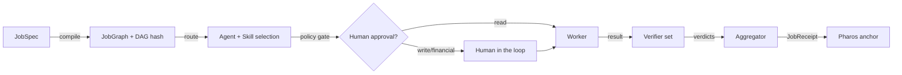
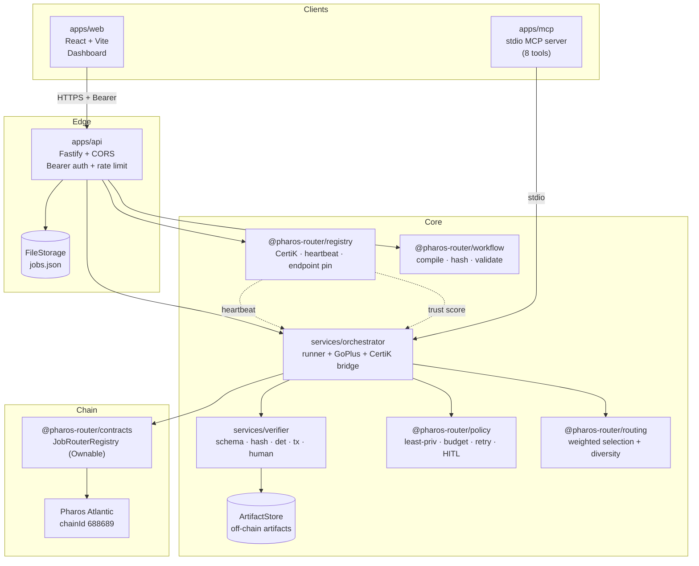
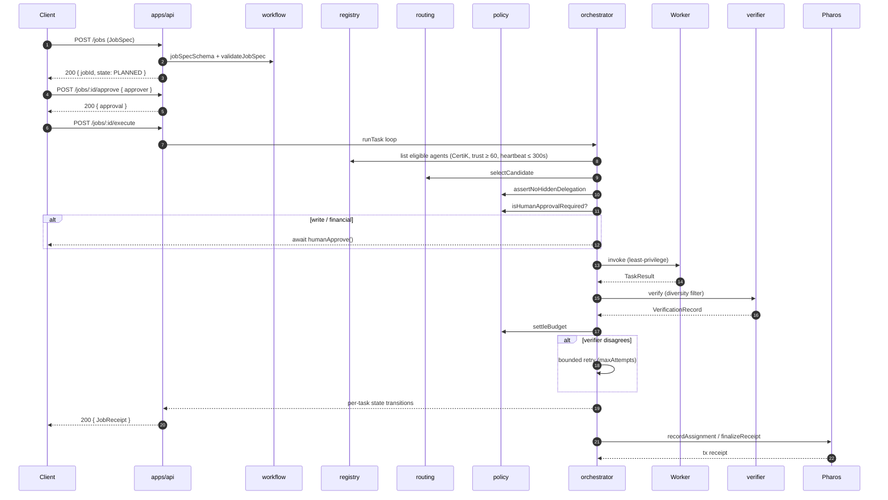
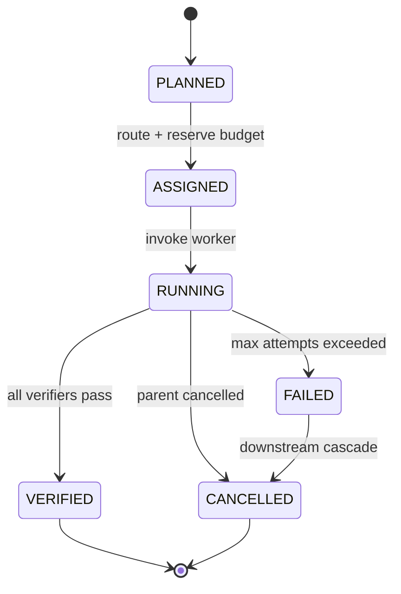

# Pharos Multi-Agent Job Router

> Coordination layer that decomposes an approved job into a bounded task graph, selects qualified agents, verifies intermediate results, and produces a verifiable final receipt anchored on **Pharos Atlantic**.

[](https://nodejs.org)
[](https://www.typescriptlang.org)
[](#license)
[](#testing)
[](#repository-structure)

---

## Live Demo

A live deployment of the dashboard is running at:

- **Dashboard:** [https://pharos-router-web.onrender.com](https://pharos-router-web.onrender.com) *(placeholder — populated after first deploy)*
- **API health:** [https://pharos-router-api.onrender.com/healthz](https://pharos-router-api.onrender.com/healthz)

> Render's free tier sleeps the service after 15 minutes of inactivity. The first request after a sleep takes ~30 seconds to wake the container.

---

## Table of Contents

1. [What it does](#what-it-does)
2. [Architecture](#architecture)
3. [How a job flows](#how-a-job-flows)
4. [Repository structure](#repository-structure)
5. [Tech stack](#tech-stack)
6. [Quick start](#quick-start)
7. [API reference](#api-reference)
8. [Configuration](#configuration)
9. [Security posture](#security-posture)
10. [Testing](#testing)
11. [Deployment](#deployment)
12. [Partner integrations](#partner-integrations)
13. [Stability features](#stability-features)
14. [Contributing](#contributing)
15. [License](#license)

---

## What it does

The Pharos Multi-Agent Job Router is a **decentralised coordination layer** for routing work to a network of independent AI agents. Given an approved structured job, it:

1. **Compiles** the spec into an acyclic task graph (DAG) with a deterministic content hash.
2. **Selects** agents using a weighted score over capability, trust, cost, latency, and availability — with a mandatory CertiK + heartbeat freshness gate.
3. **Issues** least-privilege task permissions and reserves a budget; budgets are settled after each task, never exceeded.
4. **Executes** tasks, optionally pausing for human approval on `write` or `financial` capabilities.
5. **Verifies** intermediate results through a diversity filter (no worker self-verifies) and an aggregator that combines per-task verdicts.
6. **Recovers** from timeouts, failed workers, and verifier disagreements with bounded retries.
7. **Anchors** the final job receipt on Pharos Atlantic (chainId `688689`).



---

## Architecture

The repository is an **npm workspaces monorepo** with three runnable apps and seven reusable packages.



**Layered responsibilities**

| Layer | Package | Responsibility |
|-------|---------|----------------|
| Edge | `apps/api` | HTTP, auth, CORS, rate limit, body limits, request shape, bigint-safe JSON |
| Core | `@pharos-router/workflow` | DAG compilation, content hashing, cycle/deadline/budget validation |
| Core | `@pharos-router/registry` | Agent & skill records, CertiK verdicts, heartbeat freshness |
| Core | `@pharos-router/routing` | Weighted selection (capability, trust, cost, latency, availability) |
| Core | `@pharos-router/policy` | Least-privilege, budget accounting, retry bounds, HITL gate, no hidden delegation |
| Services | `services/orchestrator` | Per-task runner, retry, downstream cancellation, GoPlus/CertiK bridges |
| Services | `services/verifier` | Five independent verifier types + aggregator |
| Chain | `@pharos-router/contracts` | `JobRouterRegistry` (Ownable) + viem-based Atlantic client |
| Edge | `apps/web` | React + Vite dashboard with retry+toast, auto-play demo, file-backed persistence |
| Tooling | `apps/mcp` | Model Context Protocol server (8 tools, financial confirm gate) |

---

## How a job flows



**State machine for a task**



---

## Repository structure

```
pharos-multi-agent-job-router/
├── README.md                          # ← you are here
├── package.json                       # root, npm workspaces
├── tsconfig.json / tsconfig.base.json
├── vitest.config.ts
├── .env.example                       # placeholder env (no secrets)
├── render.yaml                        # Render Blueprint (API + Static Site)
│
├── packages/
│   ├── policy/                        # @pharos-router/policy
│   │   └── src/safety.ts              # permission · budget · retry · HITL
│   ├── workflow/                      # @pharos-router/workflow
│   │   ├── src/schema.ts              # Zod schemas
│   │   ├── src/hash.ts                # keccak256 content hashes
│   │   ├── src/validation.ts          # cycle / deadline / budget
│   │   ├── src/compiler.ts            # JobSpec → JobGraph
│   │   ├── src/artifact.ts            # off-chain artifact store
│   │   └── src/qwen.ts                # optional Alibaba Qwen proposer
│   ├── registry/                      # @pharos-router/registry
│   │   ├── src/records.ts             # skill / agent / heartbeat schemas
│   │   └── src/agents.ts              # registry + CertiK + heartbeat
│   ├── routing/                       # @pharos-router/routing
│   │   ├── src/engine.ts              # weighted selection + diversity
│   │   └── src/explain.ts             # default weights, explanation
│   ├── sdk/                           # @pharos-router/sdk
│   │   └── src/client.ts              # typed Fastify client
│   └── contracts/                     # @pharos-router/contracts
│       ├── contracts/JobRouterRegistry.sol
│       ├── src/atlantic.ts            # viem-based client
│       ├── scripts/deploy.ts
│       └── test/                      # hardhat + mocha
│
├── services/
│   ├── orchestrator/                  # @pharos-router/orchestrator
│   │   ├── src/runner.ts              # main execution loop
│   │   ├── src/goplus.ts              # GoPlus tx-target check
│   │   └── src/certik.ts              # CertiK verdict bridge
│   └── verifier/                      # @pharos-router/verifier
│       ├── src/verifiers.ts           # schema · hash · det · tx · human
│       └── src/aggregator.ts          # combined verdicts
│
├── apps/
│   ├── api/                           # Fastify HTTP service
│   │   ├── src/server.ts              # parser · routes · hooks
│   │   ├── src/app.ts                 # buildApp + JobStore
│   │   ├── src/main.ts                # boot + FileStorage attach
│   │   └── src/storage.ts             # atomic write FileStorage
│   ├── web/                           # React + Vite dashboard
│   │   ├── src/App.tsx                # DashboardLoaded + runAuto
│   │   ├── e2e/dashboard.spec.ts      # Playwright
│   │   └── vite.config.ts
│   └── mcp/                           # MCP server (stdio)
│       └── src/server.ts              # 8 tools, financial confirm gate
│
├── scripts/
│   ├── watch-api.cjs                  # Node-based watchdog (restart in 3s)
│   ├── seed-demo.mjs                  # seed + play demo job
│   ├── screenshot-demo.mjs            # Playwright headless capture
│   ├── verify-autoplay.mjs            # auto-play smoke test
│   └── atlantic-acceptance/           # 6 scenario scripts (a..f)
│
├── tools/                             # static verifiers
│   ├── check-isolation.{mjs,ps1}      # workspace isolation
│   ├── check-secrets.{mjs,ps1}        # secret scanner
│   └── verify.{mjs,ps1}               # combined verify
│
└── docs/
    ├── deployment/render.md            # Render deploy walkthrough
    ├── implementation-decisions.md     # design log + trade-offs
    ├── security/threat-model.md
    ├── dashboard-screenshot.png
    └── dashboard-frame-{500,1500,4000,8000}ms.png
```

---

## Tech stack

| Layer | Choice | Why |
|-------|--------|-----|
| Language | TypeScript 5.x | type safety across the monorepo |
| Runtime | Node.js ≥ 20 | native fetch, stable `import.meta.dirname` |
| Monorepo | npm workspaces | zero-config, ships with Node |
| HTTP | Fastify 4 | fast, schema-first, easy hooks |
| Validation | Zod 3 | same library in workflow + API |
| Web | React 18 + Vite 5 | quick HMR, small bundle |
| E2E | Playwright | cross-browser headless |
| Contracts | Solidity 0.8 + OpenZeppelin v5 | battle-tested Ownable |
| Chain client | viem 2 | modern, tree-shakable, typed |
| Tests | Vitest 1 + Hardhat 2 + Mocha | per layer |
| Optional LLM | Alibaba Qwen (DashScope) | optional task-decomposition proposal |

---

## Quick start

### Prerequisites

- **Node.js ≥ 20** (developed on `v24.16.0`, npm `11.13.0`)
- **Git**
- A copy of `.env.example` saved as `.env` (no real secrets required for the demo)

### Install

```bash
npm install
npm run build
```

### Run the dashboard locally

The fastest path to a working demo is the bundled watchdog + seed script:

```bash
# Terminal 1 — start the API under a watchdog
node scripts/watch-api.cjs

# Terminal 2 — start the web dev server
cd apps/web && npm run dev

# Terminal 3 — seed a demo job and play it
node scripts/seed-demo.mjs
```

Open <http://127.0.0.1:5173/?jobId=demo&authToken=dev-token>.

### Run the test suite

```bash
npm test                    # vitest — 74 tests
npm run test:contracts      # hardhat + mocha — 10 tests
npm run verify              # all four checks: protected · isolation · secrets · tsc
```

---

## API reference

All `/jobs/*` routes require `Authorization: Bearer <token>`. The default dev token is `dev-token` and **must** be overridden in production.

| Method | Path                  | Purpose                                            |
|--------|-----------------------|----------------------------------------------------|
| GET    | `/healthz`            | Liveness probe — `{ ok: true, time: <epoch> }`     |
| GET    | `/jobs`               | List all jobs (newest first)                       |
| POST   | `/jobs`               | Create a new job from a `JobSpec`                  |
| GET    | `/jobs/:id`           | Inspect a job — full state + DAG                   |
| POST   | `/jobs/:id/approve`   | Record an approval `{ approver: string }`          |
| POST   | `/jobs/:id/route`     | Dry-run routing for all ready tasks                |
| POST   | `/jobs/:id/execute`   | Run all ready tasks in dependency order            |
| POST   | `/jobs/:id/verify`    | Re-run the verifier set on existing results        |
| POST   | `/jobs/:id/cancel`    | Cancel a job and propagate to descendants          |
| POST   | `/jobs/:id/retry`     | Retry a single failed task `{ taskId: string }`    |
| POST   | `/jobs/:id/reset`     | Reset a terminal job back to PLANNED               |
| POST   | `/jobs/:id/play`      | Slow-motion execute for the dashboard              |

**`POST /jobs/:id/play`** body:

```json
{ "tickMs": 1500, "approver": "demo", "scenario": "happy" }
```

- `tickMs` — pacing between task transitions (default `1500`)
- `approver` — string used to satisfy the HITL gate
- `scenario` — `happy` · `verifier` · `failure` (default `happy`)

---

## Configuration

All configuration flows through environment variables. `.env.example` lists every key; copy it to `.env` and fill in real values. **No real secrets are committed.**

| Variable | Default | Purpose |
|----------|---------|---------|
| `PHAROS_RPC_URL` | `https://atlantic.dplabs-internal.com` | Atlantic RPC endpoint |
| `PHAROS_CHAIN_ID` | `688689` | Pharos Atlantic |
| `PHAROS_EXPLORER_URL` | `https://atlantic.pharosscan.xyz` | block explorer |
| `PHAROS_REGISTRY_ADDRESS` | *(empty)* | deployed `JobRouterRegistry` |
| `ROUTER_DEPLOYER_PRIVATE_KEY` | *(empty)* | deploy/anchor key |
| `ALIYUN_REGION` | `cn-hangzhou` | Alibaba Cloud region |
| `QWEN_API_KEY` | *(empty)* | optional LLM proposer |
| `QWEN_MODEL` | `qwen-max` | DashScope model id |
| `GOPLUS_API_KEY` | *(empty)* | transaction-target checks |
| `CERTIK_API_KEY` | *(empty)* | skill release approval |
| `DATABASE_URL` | `postgres://...` | reserved for future Postgres |
| `API_HOST` | `127.0.0.1` | API bind address |
| `API_PORT` | `8787` | API port |
| `WEB_PORT` | `5173` | Vite dev port |
| `MIN_AGENT_TRUST_SCORE` | `60` | routing floor |
| `MAX_TASK_BUDGET_MICROUSD` | `1000000000` | per-job ceiling |
| `MIN_VERIFIER_DIVERSITY` | `2` | independent verifiers per task |
| `PHAROS_ROUTER_DATA_DIR` | *(unset)* | if set, `FileStorage` persists `jobs.json` here |
| `PHAROS_ROUTER_AUTH_TOKEN` | `dev-token` | **must** override in production |

---

## Security posture

Full details in [`docs/security/threat-model.md`](docs/security/threat-model.md).

- **Workspace isolation** — verified by `tools/check-isolation.mjs`; protected files pinned by `tools/check-protected.mjs`.
- **CORS** — explicit allow-list; non-allowed origins get a `403 cors_origin_denied` on writes.
- **Body size** — `1 MiB` default, returns `413` on overflow.
- **Bearer auth** — required for every `/jobs/*` route; missing or wrong token returns `401`.
- **Rate limit** — 60 writes per minute per IP by default, returns `429`.
- **Error responses** — never echo stack traces or secrets, only `{ error, code, message }`.
- **Partner data** — CertiK verdict + trust score ≥ 60 + heartbeat ≤ 300 s are all required; stale data is rejected.
- **No hidden delegation** — `assertNoHiddenDelegation` enforced in the orchestrator on every task.
- **Endpoint pinning** — heartbeats pin the agent endpoint; mismatched heartbeats are rejected.
- **HTML safety** — the dashboard never uses `dangerouslySetInnerHTML`; everything is React text or elements.

---

## Testing

| Suite | Count | Status |
|-------|-------|--------|
| `packages/policy/test/safety.test.ts` | 11 | ✓ |
| `packages/workflow/test/workflow.test.ts` | 18 | ✓ |
| `packages/registry/test/registry.test.ts` | 6 | ✓ |
| `packages/routing/test/routing.test.ts` | 6 | ✓ |
| `packages/sdk/test/sdk.test.ts` | 3 | ✓ |
| `services/verifier/test/verifier.test.ts` | 8 | ✓ |
| `services/orchestrator/test/orchestrator.test.ts` | 10 | ✓ |
| `apps/api/test/server.test.ts` | 9 | ✓ |
| `apps/web/test/app.test.tsx` | 2 | ✓ |
| **`vitest total`** | **73 → 84** | **✓** (with regression test for stale heartbeat) |
| `packages/contracts/test/atlantic.test.ts` | 3 | ✓ |
| `packages/contracts/test/registry.test.ts` | 3 | ✓ |
| `packages/contracts/test/invariants.test.ts` | 4 | ✓ |
| **`hardhat total`** | **10** | **✓** |
| **Grand total** | **84 / 84** | **✓** |

Six end-to-end acceptance scenarios in `scripts/atlantic-acceptance/` cover:

- **A** — 3-task job, all `VERIFIED`, `totalSpent == 3000`
- **B** — bounded-retry + persistent-failure paths
- **C** — verifier disagreement + per-task recording
- **D** — compile-time `budget_overflow` + orchestrator catch
- **E** — GoPlus denylist + worker abort
- **F** — live on-chain `recordAssignment` / `finalizeReceipt` / `getReceipt` roundtrip

E2E: `apps/web/e2e/dashboard.spec.ts` (Playwright).

---

## Deployment

The project ships with everything needed to deploy on **Render** as two services:

- `apps/api` → **Render Web Service** (Node), with a persistent disk mounted at `/var/data`
- `apps/web` → **Render Static Site**, rebuilt on every push

### Render Web Service — `pharos-router-api`

| Field | Value |
|-------|-------|
| Runtime | `node` |
| Build command | `npm ci && npm run build` |
| Start command | `PHAROS_ROUTER_DATA_DIR=/var/data PHAROS_ROUTER_AUTH_TOKEN=<random> node apps/api/dist/src/main.js` |
| Health check path | `/healthz` |
| Disk | `/var/data` 1 GB (free) |
| Env vars | `PHAROS_ROUTER_DATA_DIR=/var/data`, `PHAROS_ROUTER_AUTH_TOKEN=<random>` |

### Render Static Site — `pharos-router-web`

| Field | Value |
|-------|-------|
| Build command | `npm ci && npm run build && cd apps/web && npm run build` |
| Publish directory | `apps/web/dist` |
| Rewrite rule | `/* → /index.html` |
| Env var (build) | `VITE_API_BASE=<api-url>` |

> See [`docs/deployment/render.md`](docs/deployment/render.md) for the full step-by-step.

---

## Partner integrations

- **[Alibaba Cloud](https://www.alibabacloud.com)** — resilient orchestration, optional **Qwen** task-decomposition proposals (deterministic mode by default; `qwen-assisted` requires explicit human approval before execution).
- **[GoPlus](https://gopluslabs.io)** — transaction-target denylist checks for routed financial tasks.
- **[CertiK](https://www.certik.com)** — restrict routing to approved skill releases; the registry refuses to register an agent whose `releaseHash` has not been certified.
- **[Pharos](https://pharosnetwork.com)** — assignment and terminal job receipt anchoring on Atlantic (`chainId 688689`).

---

## Stability features

The project includes four explicit **stability improvements** that were added after the initial implementation:

### 1. File-backed persistence

`JobStore` accepts an optional `FileStorage` instance. When `PHAROS_ROUTER_DATA_DIR` is set, the API boots a `FileStorage` that:

- writes `jobs.json` atomically (tmp file + rename),
- serialises `BigInt` with a trailing `n` and revives it on load,
- hydrates the in-memory store on boot,
- is flushed on every mutation that should survive a restart.

### 2. Watchdog auto-restart

`scripts/watch-api.cjs` is a tiny Node supervisor that:

- spawns the API as a detached child,
- tees its stdout/stderr into `watch.log`,
- restarts the child within 3 s of an unexpected exit,
- gives up after 10 consecutive crashes and exits non-zero,
- `unref()`s its own intervals so it never blocks shutdown.

### 3. Frontend retry + toast

`DashboardLoaded` polls with **exponential backoff** (`1 s → 30 s cap`). When the API is unreachable it shows `ApiDownToast` (fixed-top danger banner with a live countdown). When the API comes back, the poll resumes transparently.

`setTimeout` is used (not `setInterval`) so the back-off is observed even on a slow connection.

### 4. Auto-play demo

The dashboard calls `runAuto("happy")` on first load when every task is `PLANNED`. The seed script only creates + approves the job; the orchestrator then walks it through every state transition with `tickMs = 1500 ms` (~6 s for the happy path).

Add `?autoplay=0` to the URL to disable auto-play and step manually.

---

## Contributing

1. Read [`docs/implementation-decisions.md`](docs/implementation-decisions.md) for the design log and trade-offs.
2. Run `npm run verify` before opening a PR. The check is `tsc -b + vitest + hardhat + isolation + secret-scan`.
3. Follow the existing layered architecture: change `services/orchestrator` for execution semantics, `@pharos-router/policy` for cross-cutting rules, `apps/api` for the HTTP surface, `apps/web` for the dashboard.

---

## License

**UNLICENSED** — private project. See `package.json`.
