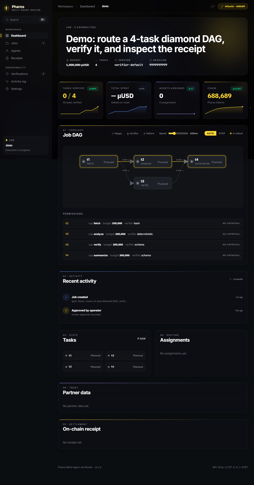
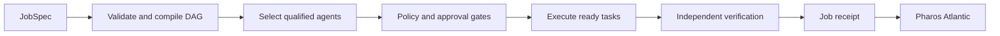
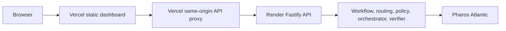

# Pharos Multi-Agent Job Router

> A policy-aware coordination layer that compiles approved jobs into a task
> graph, routes each task to qualified agents, verifies intermediate results,
> and can anchor the final receipt on Pharos Atlantic.

[](https://nodejs.org)
[](https://www.typescriptlang.org)
[](#testing)
[](LICENSE)



## Live Demo

| Service | URL | Hosting |
|---|---|---|
| Dashboard | [Open the seeded demo](https://pharos-router-web.vercel.app/?jobId=demo&authToken=dev-token&autoplay=0) | Vercel |
| API health | [Check `/healthz`](https://pharos-router-api-jrst.onrender.com/healthz) | Render Free |

The public deployment is a demonstration environment. It currently uses the
well-known `dev-token`; do not use that token for a private or production
deployment.

Render Free suspends inactive services. The first request after a period of
inactivity can take roughly 30-60 seconds. The API stores jobs in memory on
the free tier and automatically recreates the `demo` job after a cold start.

### Using the DAG controls

1. Choose `AUTO` or `STEP`.
2. Click `Happy`, `Verifier`, or `Failure` to start that scenario.
3. In `AUTO`, the API executes the job and the dashboard polls each state
   transition. In `STEP`, the dashboard exposes controls for advancing,
   replaying, or resetting the visual sequence.

`AUTO` and `STEP` select the playback mode; they do not start a scenario by
themselves. Remove `autoplay=0` from the demo URL to start the happy path
automatically when all tasks are `PLANNED`.

## Overview

Given a structured `JobSpec`, the router:

1. Validates deadlines, budgets, dependencies, and allowed capabilities.
2. Compiles the job into a deterministic directed acyclic graph (DAG).
3. Selects agents using capability, trust, cost, latency, and availability.
4. Applies least-privilege permissions, bounded retries, and human approval
   gates for sensitive work.
5. Executes ready tasks while propagating downstream cancellation on failure.
6. Verifies results using independent verifier types and a diversity filter.
7. Produces a final receipt and, when configured, anchors it on Pharos
   Atlantic (`chainId 688689`).



## Production Architecture

The deployed dashboard and API are split across two hosts:



- Vercel serves the Vite bundle from `apps/web/dist`.
- `api/proxy.mjs` forwards only `/healthz` and `/jobs/*` requests to Render.
  It preserves the JSON body and bearer token while avoiding browser CORS
  failures on write requests.
- Render runs the long-lived Fastify API and slow-motion demo orchestrator.
- The chain integration is enabled only when a registry address and deployer
  credentials are configured. Secrets are never committed to the repository.

## Repository Structure

This is an npm workspaces monorepo with 11 workspaces.

| Area | Path | Responsibility |
|---|---|---|
| HTTP API | `apps/api` | Fastify routes, bearer auth, CORS, limits, demo seeding |
| Dashboard | `apps/web` | React and Vite UI, polling, playback controls, retry toast |
| MCP server | `apps/mcp` | Eight `pharos_router_*` tools over stdio |
| Workflow | `packages/workflow` | Job validation, DAG compilation, hashes, artifact storage |
| Registry | `packages/registry` | Agent records, skills, trust, heartbeat freshness, CertiK gate |
| Routing | `packages/routing` | Weighted agent selection and verifier diversity |
| Policy | `packages/policy` | Permissions, budgets, retries, HITL, hidden-delegation checks |
| SDK | `packages/sdk` | Typed fetch client for the HTTP API |
| Contracts | `packages/contracts` | Solidity registry and viem Atlantic client |
| Orchestrator | `services/orchestrator` | Task execution, retries, cancellation, partner bridges |
| Verifier | `services/verifier` | Schema, hash, deterministic, transaction, and human verifiers |

## Quick Start

### Requirements

- Node.js 20 or newer
- npm
- Git

### Install and build

```bash
git clone <repository-url>
cd 04-multi-agent-job-router
npm ci --include=dev
npm run build
```

The demo works without partner API keys. Copy `.env.example` to `.env` only
when you need to override the defaults or configure external integrations.

### Run locally

Use three terminals from the repository root:

```bash
# Terminal 1: API with automatic restart, http://127.0.0.1:8787
node scripts/watch-api.cjs

# Terminal 2: Vite dashboard, http://127.0.0.1:5173
cd apps/web
npm run dev

# Terminal 3: create and replay the demo job
node scripts/seed-demo.mjs
```

Open:

```text
http://127.0.0.1:5173/?jobId=demo&authToken=dev-token
```

To inspect a planned job without automatic playback, append `&autoplay=0`.

## HTTP API

All `/jobs/*` endpoints require:

```http
Authorization: Bearer <PHAROS_ROUTER_AUTH_TOKEN>
```

`/healthz` is public.

| Method | Path | Purpose |
|---|---|---|
| `GET` | `/healthz` | Liveness probe |
| `GET` | `/jobs` | List jobs, newest first |
| `POST` | `/jobs` | Create a job from a `JobSpec` |
| `GET` | `/jobs/:id` | Inspect the complete job state and DAG |
| `POST` | `/jobs/:id/approve` | Record `{ "approver": "..." }` |
| `POST` | `/jobs/:id/route` | Dry-run routing for ready tasks |
| `POST` | `/jobs/:id/execute` | Execute ready tasks |
| `POST` | `/jobs/:id/verify` | Re-run verifiers |
| `POST` | `/jobs/:id/cancel` | Cancel a job and descendants |
| `POST` | `/jobs/:id/retry` | Retry `{ "taskId": "..." }` |
| `POST` | `/jobs/:id/reset` | Reset a terminal job to `PLANNED` |
| `POST` | `/jobs/:id/play` | Run a paced dashboard scenario |

Example:

```bash
curl http://127.0.0.1:8787/jobs/demo \
  -H "Authorization: Bearer dev-token"

curl -X POST http://127.0.0.1:8787/jobs/demo/play \
  -H "Authorization: Bearer dev-token" \
  -H "Content-Type: application/json" \
  -d '{"tickMs":1500,"approver":"demo","scenario":"happy"}'
```

Supported demo scenarios are `happy`, `verifier`, and `failure`.

## TypeScript SDK

`@pharos-router/sdk` is a typed fetch wrapper and works in Node.js 20+ or a
browser environment with `fetch`.

```ts
import { RouterClient } from "@pharos-router/sdk";

const client = new RouterClient({
  baseUrl: "http://127.0.0.1:8787",
  headers: {
    authorization: `Bearer ${process.env.PHAROS_ROUTER_AUTH_TOKEN}`,
  },
});

const job = await client.inspectJob("demo");
await client.playJob(job.jobId, {
  tickMs: 1500,
  scenario: "happy",
});
```

Non-success responses throw `RouterApiError` with the HTTP status and parsed
response body.

## MCP Server

Build the repository, then start the stdio server:

```bash
node apps/mcp/dist/src/server.js
```

| Tool | Purpose |
|---|---|
| `pharos_router_create` | Create a job |
| `pharos_router_approve` | Approve a job |
| `pharos_router_route` | Preview routing |
| `pharos_router_execute` | Execute; requires `confirm === true` |
| `pharos_router_verify` | Re-run verification |
| `pharos_router_cancel` | Cancel a job |
| `pharos_router_retry` | Retry a failed task |
| `pharos_router_inspect` | Inspect a job |

The execute tool is considered financial and rejects calls without explicit
confirmation before any state change occurs.

## Configuration

See [`.env.example`](.env.example) for the complete template.

| Variable | Default | Purpose |
|---|---|---|
| `PHAROS_RPC_URL` | Atlantic RPC | Pharos JSON-RPC endpoint |
| `PHAROS_CHAIN_ID` | `688689` | Expected chain ID |
| `PHAROS_REGISTRY_ADDRESS` | empty | Deployed contract address |
| `ROUTER_DEPLOYER_PRIVATE_KEY` | empty | Receipt anchoring key; never commit |
| `PHAROS_ROUTER_AUTH_TOKEN` | `dev-token` | API bearer token; override outside demos |
| `PHAROS_ROUTER_DATA_DIR` | unset | Enables file-backed `jobs.json` storage |
| `PHAROS_ROUTER_AUTO_SEED` | unset | Set to `1` to recreate the demo on empty storage |
| `MIN_AGENT_TRUST_SCORE` | `60` | Minimum routing trust score |
| `MIN_VERIFIER_DIVERSITY` | `2` | Required independent verifier count |
| `QWEN_API_KEY` | empty | Optional Qwen task proposer |
| `GOPLUS_API_KEY` | empty | Optional transaction safety checks |
| `CERTIK_API_KEY` | empty | Optional skill release verification |

## Task State Model

```text
PLANNED -> ASSIGNED -> RUNNING -> VERIFIED
                           |-> FAILED
                           |-> CANCELLED
```

Every task transition is retained in the job state. When chain anchoring is
configured, assignment and receipt data can also be recorded on Pharos.

## Testing

```bash
npm test                 # Vitest: 85 tests
npm run test:contracts  # Hardhat/Mocha: 11 tests
npm run verify          # TypeScript, tests, contracts, isolation, secrets
```

Current automated total: **96 passing tests**.

The Atlantic acceptance scripts in `scripts/atlantic-acceptance/` additionally
cover successful execution, bounded retries, verifier disagreement, budget
overflow, GoPlus denial, and live receipt round-trips.

## Security

- Every `/jobs/*` route requires bearer authentication.
- Write requests are rate-limited and request bodies are capped at 1 MiB.
- CORS uses an explicit allow-list; it is not globally open.
- Financial MCP execution requires `confirm === true`.
- Agent eligibility requires trust, freshness, and certified release checks.
- Task execution enforces least privilege and rejects hidden delegation.
- API errors do not expose stack traces or secrets.
- The dashboard never renders untrusted HTML with `dangerouslySetInnerHTML`.

See [`docs/security/threat-model.md`](docs/security/threat-model.md) for the
full threat model.

## Deployment

### Current public deployment

- Dashboard: Vercel project `pharos-router-web`
- API: Render service `pharos-router-api-jrst`
- Browser API base: `https://pharos-router-web.vercel.app`
- Upstream API: `https://pharos-router-api-jrst.onrender.com`

The browser uses the Vercel origin for API requests. Routes under `/jobs/*`
and `/healthz` are forwarded by the Vercel Function in `api/proxy.mjs`.

### Deploy the dashboard

```bash
npx vercel link
npx vercel env add VITE_API_BASE production
npx vercel --prod
```

For the current same-origin setup, set `VITE_API_BASE` to the final Vercel
origin, for example `https://pharos-router-web.vercel.app`.

### Deploy the API

`render.yaml` defines the Render service. The important production settings
are:

- build command: `npm ci --include=dev && npm run build`
- start command: `node apps/api/dist/src/main.js`
- health check: `/healthz`
- `PHAROS_ROUTER_AUTO_SEED=1` on free, ephemeral storage
- a strong `PHAROS_ROUTER_AUTH_TOKEN` for non-demo deployments

Never put `ROUTER_DEPLOYER_PRIVATE_KEY` or production bearer tokens in source
control. Configure them in the hosting provider's environment settings.

Deployment references:

- [`docs/deployment/vercel.md`](docs/deployment/vercel.md)
- [`docs/deployment/render.md`](docs/deployment/render.md)
- [`docs/deployment/railway.md`](docs/deployment/railway.md), available as an
  alternative API hosting option

## Known Limitations

- Render Free cold starts can delay the first API response.
- Free-tier storage is ephemeral; the public deployment is a demo, not a
  durable job database.
- The current Vercel proxy upstream is configured for the public Render API.
- On-chain anchoring requires a funded deployer and a deployed registry.
- Optional Qwen, GoPlus, and CertiK integrations require provider credentials.

## Contributing

1. Read [`AGENTS.md`](AGENTS.md) and
   [`docs/implementation-decisions.md`](docs/implementation-decisions.md).
2. Keep changes within the package that owns the behavior.
3. Run `npm run verify` before opening a pull request.
4. Never commit credentials, private keys, or production bearer tokens.

Project-specific instructions for compatible coding agents are available at
[`.agents/skills/pharos-multi-agent-job-router/SKILL.md`](.agents/skills/pharos-multi-agent-job-router/SKILL.md).

## License

MIT. See [`LICENSE`](LICENSE).
